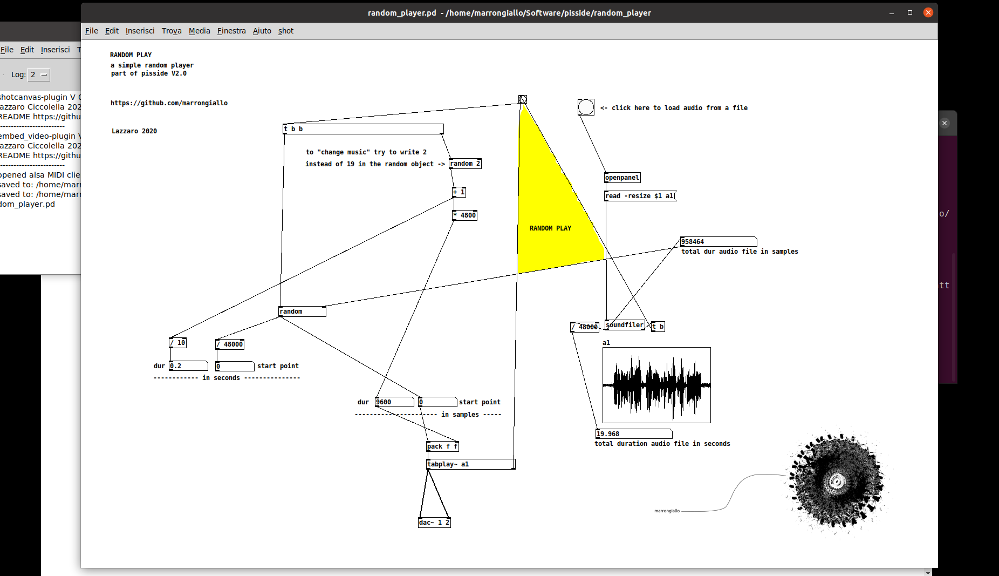

# random_player.pd

Before to try to execute random_play.pd

you need to install the pure data application.
Puredata (Pd) is a open source software.
You can download and install it for your specific system (windows, apple or linux) at 

[https://puredata.info/downloads/pure-data](https://puredata.info/downloads/pure-data)

There are some different flavour of puredata, I advice you tu use, as a beginner, the Miller Puckett's **"vanilla"** distribution of Pd.

After you have installed pure data, open the application and from the "file" menu, find and open the random_player.pd file.

As you know you will have to load an audio file into the program, remember that you can **only load .wav and .aiff** audio files. In this example You can NOT load an mp3 file.

Enjoy

random_player.pd is part of project pisside

# pisside
sound-music-art installation - examples and tutorials

This artwork "pisside" was born within the "STAY WITH ME" project. In this repository you can find examples, lessons and instructions for interacting with "pisside".

ref.
- https://stay-with-me.org/
- my room https://stay-with-me.org/room-6/
